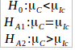
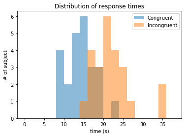
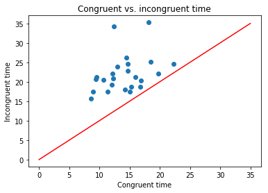
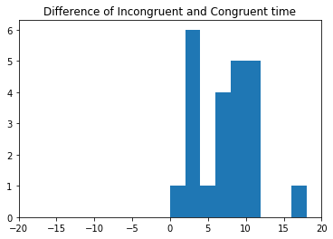

# Test perceptual phenomenon   Udacity DAND report

## Q1: What is our independent variable? What is our dependent variable?
The independent variable is that phenomenon, condition which we can set/modify, and the dependent variable is that value which depends from what we set. In this experiment, the independent variable is the condition of the experiment: whether it was congruent or incongruent word? The dependent variable will be the response time of a subject.
## Q2: What is an appropriate set of hypotheses for this task? What kind of statistical test do you expect to perform?
We have only two variables and two possible values for independent variable (categorical), so we don't have too many options.

First, we could measure if the mean of the congruent/incongruent group significantly differs from a fixed value? For example if researchers have some initial assumption about response time, they can measure whether it is correct? However, in this case the task didn't provide any threshold.

The second hypothesis could be the following:

*"Does the response time in case of congruent words significantly better (i.e. lower) than in case of incongruent words?"*

With formulas:

To investigate this hypothesis I would use some paired test (it depends on normality that paired t-test or signed Wilcoxon test).

## Q3: Descriptive statistics about the dataset
Some important descriptive statistics:

<table>
<tr><th>Value name</th><th>congruent</th><th>incongruent</th></tr>
<tr><td>Number of subjects</td><td>24</td><td>24</td></tr>
<tr><td>Mean</td><td>14.05</td><td>22.016</td></tr>
<tr><td>Median</td><td>14.356</td><td>21.0175</td></tr>
<tr><td>Standard deviation</td><td>3.56</td><td>4.797</td></tr>
<tr><td>IQR</td><td>4.305</td><td>5.335</td></tr>
</table>

## Q4: Visualization of the data

On this plot we can see the distribution of response times of the two conditions. It is clear, that there is a difference, and the incongruent is larger.

On this plot I displayed the congruent vs. incongruent times. The red line is the x=y line, that means when the two time is equal. It is clear again, that incongruent time is larger than congruent time at each case. We can see the same on the last plot, where I displayed the difference of the two condition of the same subject. The difference is always positive, so for each subject, the incongruent time is larger.

## Q5: Statistical tests, statistical significance
To assess the significance of my initial hypothesis (incongruent response is differ significantly from congruent) I used paired t-test. On the initial plot, I could see that my dataset follows a normal distribution, but I have to test it. I performed a Kolmogorov-Smirnov test for normality. For both conditions, it gave p=1.0 so I can use t-test.

First, I calculated the difference between the two groups. Then I calculated the mean and standard deviation of this difference. The mean was 7.96, standard deviation 4.86, standard error of mean 0.993. The test statistic for this test is the mean divided by the SE. My T statistic became 8.02. According to the t distribution, this T value has p=4.1e-8, so I couldn't reject the hypothesis that the response time between the two conditions significantly different with confidence level alpha = 0.001.

This result means that subjects performed worse during incongruent words than at congruent words. This finding is what I would expect in advance.
## Q6: Discussion
I think that there is some association between human brain's color and text recognizer parts. It could be to improve the performance of the brain - support understanding of text with other information about the environment.
The fact that incongruent task went slower could mean that brain was really confused and had to do more work to find the right answer.
Another interesting task could be to measure the misinterpretation of texts. Because it can happen, that subject can respond quickly but fails in some cases.
