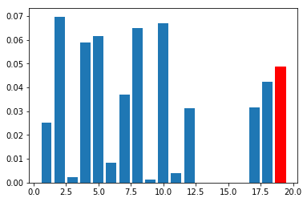
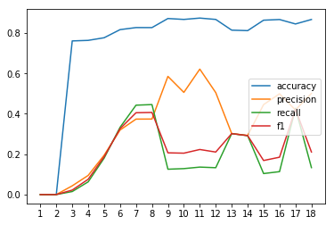

# Identify Fraud from Enron Dataset

## Project summary
The goal of the project was to train a machine learning model to identify key persons in the Enron Fraud.

### Overall description
I got many features of the Enron employees like salary, bonus, stock options, etc. Besides that, I got some other features like the connection between employees through e-mail. There was one more feature, the so-called POI label. It designates that a person has a significant role in the fraud.

Properties of dataset:
 - number of element: 146 (after outlier removal 142)
 - number of original features: 19
   - one feature completely removed
   - one new feature added
   - 7 feature selected automatically
 - label distribution (POI/nonPOI)
   - before removal: 18/128
   - after removal: 17/125

### Benefit of ML on this project
This dataset is suitable for supervised learning algorithms because it serves as a labeled dataset.

If we could build a good model maybe we could prevent frauds at other companies, e.g., we create a model which can predict possible fraud based on money transfer.
### Outlier identification and handling
First, I decided to retain all of features, then I will select from them using one of the feature selection methods. Because of this, I needed to check all features for outliers.

First, I found the TOTAL as outlier (as we saw in the videos).

Next, I found two people who appeared to be outlier in at least two features. These two person were LAY KENNETH L. and MARK FREVERT. However, their measurements were real and they were really involved in the fraud, I decided to remove them from the list, because I wanted to build a generalized model and any outlier can distort the result.

There were three more persons who appeared as outlier only in one feature (BHATNAGAR SANJAY (restricted_stock_deferred), PICKERING MARK R (load_advances), MARTIN AMANDA K (long_term_incentive)), so I retained them in the dataset and set their value to 0.

After removing these people, I realized that feature called loan_advances became completely zero, so I decided to remove that feature entirely from the feature matrix.

## Feature creation and selection

### Creation of new feature

I saw that there are two, somewhat related features: restricted_stock and total_stock_value. I'm not good at finance, but I think the first should be a part of the second value and it could indicate something worthy information. Therefor I created a new feature called restricted_stock_ratio, which I calculated as the ratio of restricted_stock and total_stock_value. I included this new feature to my feature matrix.

To rank my features I calculated the Mutual Information for each feature and I sorted them into descending order. For this purpose, I used mutual_info_classif function from sklearn. I set the random seed to 2 because of consistency and reproducibility. With this setting, my feature was the 5th best (red bar on the barchart).

<center>

</center>

When I performed the incremental feature selection, useing my new feature the precision/recall increased from 0.094/0.063 to 0.19/0.18. This feature isn't enough to reach the desired result, but it has a large positive impact on it.

### Feature selection

Before selecting features and trying to fit models I did one more preprocessing step: normalization. Because one of the algorithms was SVM Classifier, I needed to normalize features because this model is sensitive for different scales. I used sklearn's MinMaxScaler class.

For feature selection, I used the SelectKBest class from sklearn. To find the best number of features for each algorithm which I tried, I incremented the number of feature parameter one by one and I chose that amount which gave the best precision and recall value. To balance these two measure, I selected the best F1 score.

<center>

</center>

On this plot we can see the main validation measurements in function of number of features for the SVM. On this plot we can see many interesting facts:
 - accuracy is always high, possibly because of label imbalance
 - with more than 8 features the precision and recall will move always to the opposite direction

The highest F1 score would be in case of 17 features (F1(17)=0.423), but with 7 features I could achieve almost the same result (F1(7)=0.405) so I chose this, because smaller dimension is better.

The feature scores for the best combination was printed in the script like this:

```
other: 0.067
bonus: 0.065
expenses: 0.065
shared_receipt_with_poi: 0.065
restricted_stock_ratio: 0.058
restricted_stock_deferred: 0.037
total_stock_value: 0.037
```

## Selection of algorithm

I tried three different algorithms: SVM, DecisionTree and Gaussian Naive Bayes. For each algorithm, I found the best number of features with the method described in previous paragraph.

The algorithm performance (with the best number of features and best tuned parameters):
 - SVM: F1(7) = 0.405
 - DecisionTree: F1(6) = 0.358
 - GaussianNB: F1(8) = 0.285

Therefor, with the same set of features, the SVM algorithm performed best.

## Parameter tuning

Parameter tuning is strongly connected with "validation". E.g: our goal is to create a model which can generalize well, so can classify unseen examples correctly. This task originates in global optimization problem: we want to find that setting where the error function has the minimum value. If we would calculate the error function on the same dataset on which we trained the model, we would get a good error rate, but a poor generalization power. In short: tuning is the process where we want to find those parameters which will hopefully correctly classify unseen elements.

For the SVM and DecisionTree, I used GridSearchCV to tune parameters.

For the SVM classifier, I tuned *C* and *gamma*. First I tried SVM with different kernels, but I found that *rbf* is better so I left this parameter out from tuning.

For the DecisionTree classifier, I tuned more parameters:
 - criterion (gini or entropy)
 - max_features (5-10)
 - min_samples_split (0.1, 0.3, 0.5)
 - splitter (best, random)

For the GaussianNB I didn't have to tune anything, so I left out this step.

## Validation

Validation is the process, when we split our dataset into test- and validation set and chose model trained on training set which has the best performance on the validation set. This method help to avoid overfitting. (Overfitting means that our model reaches - usually - a nice result on the dataset on which it was built but don't generalize well, so have a bad performance on new, unseen samples.)

For validation, I used GridSearchCV with 3 split (2/3 training and 1/3 validation set) and I used F1 score as measurement. Initially I used accuracy, but later I found that my class labels are unbalanced, and my accuracy can be over 0.8 while precision or recall under 0.1. F1 score is the harmonic mean of the precision and recall (what I have to optimize), so I thought it is a good measure.

## Evaluation

To evaluate algorithms and find the best classifier, I used the provided *tester.py* script. That script uses the StratifiedShuffleSplit class from sklearn. This evaluator is a combination of two others'. The "Shuffle-part" shuffles randomly the samples before split, so the original order of data won't matter. For example, if data would be enumerate according to some structure, the evaluation would give a false result. The "Stratified-part" is responsible for preserving the original label-distribution. This is highly important in cases where the distribution of the two class is unbalanced (like here).

For each turn, I called that evaluator and I chose the algorithm/parameter setting where both of precision and recall were above the desired 0.3 and the F1 score was the highest. In other words:
 - My algorithm excedes 0.3 recall means that it found ("recalls") at least 30% of the POIs.
 - My algorithm excedes 0.3 precision, that means that at least 30% of persons what had been considered POI according to my model was indeed POI.

 It can be seen that these two measures moves in opposite direction: if my model would be "careful" not to accuse innocent people, it would miss real POIs. But if I don't want to miss any POI (increase the recall) will bring more false detection. F1 score is a good "golden mean". (In real life application, we can move to one direction, but now we created a general algorithm.)

My submitted script contains the settings with the best configuration which is:

SVM, gamma: 0.5, C=10000, kernel='rbf'
