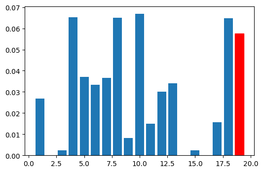

# Identify Fraud from Enron Dataset

## Project summary
The goal of the project was to train a machine learning model to identify key persons in the Enron Fraud.

### Overall description
I got many features of the Enron employees like salary, bonus, stock options, etc. Besides that, I got some other features like the connection between employees through e-mail. There was one more feature, the so-called POI label. It designates that a person has a significant role in the fraud.

Properties of dataset:
 - number of element: 146 (after outlier removal 142)
 - number of original features: 19
   - one feature completely removed
   - one new feature added
   - 7 feature selected automatically
 - label distribution (POI/nonPOI)
   - before removal: 18/128
   - after removal: 17/125

### Benefit of ML on this project
This dataset is suitable for supervised learning algorithms because it serves as a labeled dataset.

If we could build a good model maybe we could prevent frauds at other companies, e.g., we create a model which can predict possible fraud based on money transfer.
### Outlier identification and handling
First, I decided to retain all of features, then I will select from them using one of the feature selection methods. Because of this, I needed to check all features for outliers.

First, I found the TOTAL as outlier (as we saw in the videos).

Next, I found two people who appeared to be outlier in at least two features. These two person were LAY KENNETH L. and MARK FREVERT. However, their measurements were real and they were really involved in the fraud, I decided to remove them from the list, because I wanted to build a generalized model and any outlier can distort the result.

There were three more persons who appeared as outlier only in one feature (BHATNAGAR SANJAY (restricted_stock_deferred), PICKERING MARK R (load_advances), MARTIN AMANDA K (long_term_incentive)), so I retained them in the dataset and set their value to 0.

After removing these people, I realized that feature called loan_advances became completely zero, so I decided to remove that feature entirely from the feature matrix.

## Feature creation and selection

### Creation of new feature

I saw that there are two, somewhat related features: restricted_stock and total_stock_value. I'm not good at finance, but I think the first should be a part of the second value and it could indicate something worthy information. Therefor I created a new feature called restricted_stock_ratio, which I calculated as the ratio of restricted_stock and total_stock_value. I included this new feature to my feature matrix.

To rank my features I calculated the Mutual Information for each feature and I sorted them into descending order. For this purpose, I used mutual_info_classif function from sklearn. I set the random seed to 42 because of consistency and reproducibility. With this setting, my feature was the 6th best (red bar on the barchart).

When I performed the incremental feature selection, the use of my new feature increased the precision/recall from 0.047/0.019 to 0.087/0.058. This feature isn't enough to reach the desired result, but it has a large positive impact on it.

### Feature selection

Before selecting features and trying to fit models I did one more preprocessing step: normalization. Because one of the algorithms was SVM Classifier, I needed to normalize features because this model is sensitive for different scales. I used sklearn's MinMaxScaler class.

For feature selection, I used the SelectKBest class from sklearn. To find the best number of features for each algorithm which I tried, I incremented the number of feature parameter one by one and I chose that amount which gave the best precision and recall value. To balance these two measure, I selected the best F1 score.

The feature scores for the best combination was printed in the script.

## Selection of algorithm

I tried three different algorithms: SVM, DecisionTree and Gaussian Naive Bayes. For each algorithm, I found the best number of features with the method described in previous paragraph.

## Parameter tuning

For the SVM and DecisionTree, I used GridSearchCV to tune parameters.

For the SVM classifier, I tuned *C* and *gamma*. First I tried SVM with different kernels, but I found that *rbf* is better so I left this parameter out from tuning.

For the DecisionTree classifier, I tuned more parameters:
 - criterion (gini or entropy)
 - max_features (5-10)
 - min_samples_split (0.1, 0.3, 0.5)
 - splitter (best, random)

For the GaussianNB I didn't have to tune anything, so I left out this step.

## Validation

To validate parameters, I used F1 score as measurement. Initially I used accuracy, but later I found that my class labels are unbalanced, and my accuracy can be over 0.8 while precision or recall under 0.1. F1 score is the harmonic mean of the precision and recall (what I have to optimize), so I thought it is a good measure.

## Evaluation

To evaluate algorithms and find the best classifier, I used the provided *tester.py* script. For each turn, I called that evaluator and I chose the algorithm/parameter setting where both of precision and recall were above the desired 0.3 and the F1 score was the highest.

My submitted script contains the settings with the best configuration which is:
